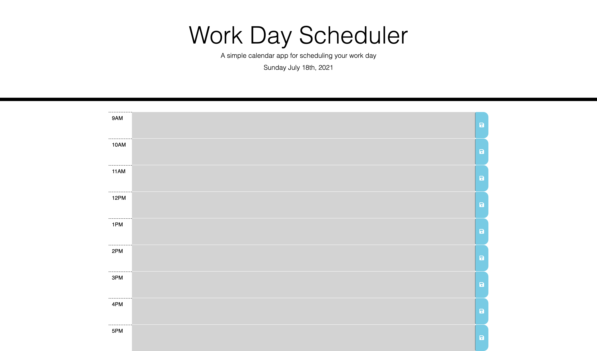

# Work Day Scheduler Starter Code

This page shows a work scheduler where users can enter events/tasks for their day based on one hour blocks.

Time-Blocks in the past are greyed out and can not be interacted with since the hour has passed.

if testing the project outside business hours you can pass different parameters to the function:

generateTimeSlots('9:00am', '5:00pm')

otherwise it will be all grey

Page can be found at : [https://gfernandez25.github.io/Work-Day-Scheduler/]
